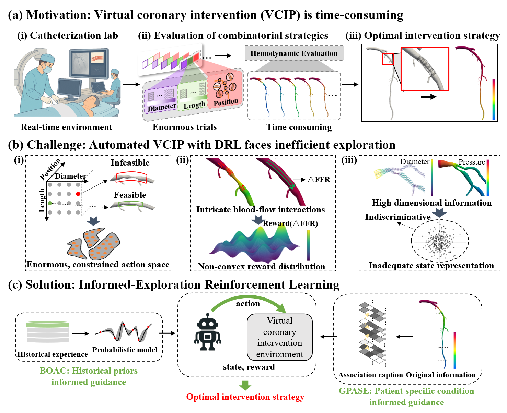

# IERL: Informed-Exploration Reinforcement Learning

<p>
  <a href="https://github.com/liuxjian146/IERL">
    
  </a>
  <a href="https://github.com/liuxjian146/IERL/stargazers">
    
  </a>
  <a href="https://github.com/liuxjian146/IERL/network/members">
    
  </a>
  <a href="https://github.com/liuxjian146/IERL/issues">
    
  </a>
  <a href="https://github.com/liuxjian146/IERL/blob/main/LISCENSE">
    
  </a>
</p>

## Introduction


Coronary artery disease (CAD) is characterised by the progressive narrowing of coronary vessels due to atherosclerotic plaque, which restricts blood supply to the myocardium. Percutaneous coronary intervention (PCI), commonly involving the deployment of an intracoronary stent, is the primary revascularisation strategy. However, optimal stent selection — determining the correct position, length, and diameter — requires synthesising complex haemodynamic and anatomical information, and remains a task that is highly dependent on operator experience.

This repository presents a reinforcement learning (RL) framework for automated coronary stent planning, formulated as a single-step decision problem in a physics-grounded simulation environment. The agent observes a multi-channel representation of the target vessel and outputs a continuous action specifying the stent implantation parameters. 

## Implementation

The RL pipeline is the primary contribution of this repository. The simulation backend is treated as a replaceable component. In the public release, hemodynamic evaluation is performed by the open-source **SimVascular svOneDSolver** ([https://github.com/SimVascular/svOneDSolver](https://github.com/SimVascular/svOneDSolver)), a 1-D finite-element solver for coronary blood flow. The solver is invoked via `simulation/interface.py` and accepts a vessel tree in `tree_dict` format.

In the full internal version of this project, the C++ solver is replaced by **BVPINO** (Bi-Variational Physics-Informed Neural Operator), a deep learning surrogate implemented on GPU for efficient hemodynamic inference. BVPINO is not included in this release due to third-party licensing restrictions.

The public release is therefore intended to demonstrate the RL architecture: the Bayesian Optimized Actor-Critic (BOAC) framework, Geometry-Physiology Aware State Encoder (GPASE), and the Virtual Coronary Intervention Environment (VCIE).

## Replacing the Finite-Element Solver with a DL-Based Surrogate

### Interface Contract

Any surrogate class must implement the same two public methods as `SimulationInterface`:

| Method | Signature | Returns |
|--------|-----------|---------|
| `__init__` | `(tree_dict: dict, ...)` | stores `self.tree_dict` |
| `compute_hemodynamic_profile` | `() -> dict` | `{"measured_ffr", "x", "ffr", "pressure", "flow"}` |
| `apply_stent_to_tree` | `(center_mm, length_mm, diam_mm) -> dict` | modified `tree_dict` |

The return dict from `compute_hemodynamic_profile` must contain:

```python
{
    "measured_ffr": float,        # scalar FFR at the distal measurement site
    "x":            np.ndarray,   # centerline positions [mm], shape (N,)
    "ffr":          np.ndarray,   # fractional flow reserve, shape (N,)
    "pressure":     np.ndarray,   # intravascular pressure [mmHg], shape (N,)
    "flow":         np.ndarray,   # volumetric flow rate [ml/s], shape (N,)
}
```

When the surrogate produces physically invalid outputs (NaN, Inf, negative values), raise `SimDivergenceError`. The environment catches this and returns an FFR-based penalty reward automatically.

### Implementation Template

Create `simulation/surrogate.py`:

```python
import numpy as np
from .interface import SimDivergenceError, SimulationInterface


class SurrogateInterface:

    def __init__(self, tree_dict: dict, model=None):
        self.tree_dict = tree_dict
        self.model = model  # your trained DL model

    def compute_hemodynamic_profile(self) -> dict:
        features = self._encode_tree(self.tree_dict)
        with torch.no_grad():
            output = self.model(features)

        ffr      = output["ffr"].cpu().numpy().astype(np.float32)
        pressure = output["pressure"].cpu().numpy().astype(np.float32)
        flow     = output["flow"].cpu().numpy().astype(np.float32)
        x        = output["x"].cpu().numpy().astype(np.float32)

        if np.isnan(ffr).any() or np.isinf(ffr).any() or (ffr < 0).any():
            raise SimDivergenceError("Surrogate produced invalid FFR output")

        return {
            "measured_ffr": float(ffr[-1]),
            "x":            x,
            "ffr":          ffr,
            "pressure":     pressure,
            "flow":         flow,
        }

    def apply_stent_to_tree(self, center_mm: float,
                             length_mm: float, diam_mm: float) -> dict:
        sim = SimulationInterface(self.tree_dict)
        return sim.apply_stent_to_tree(center_mm, length_mm, diam_mm)

    def _encode_tree(self, tree_dict: dict):
        raise NotImplementedError
```

### Plugging into Training

In `train.py`, replace the import and the `sim_interface=` argument:

```python
# Before (C++ solver)
from simulation.interface import SimulationInterface
sim_interface=SimulationInterface

# After (DL surrogate)
from simulation.surrogate import SurrogateInterface
sim_interface=SurrogateInterface
```

If the surrogate requires a pre-loaded model object, wrap it in a factory:

```python
loaded_model = load_surrogate_model("surrogate.pt")

def make_surrogate(tree_dict):
    return SurrogateInterface(tree_dict, model=loaded_model)

sim_interface=make_surrogate
```

The environment calls `self.sim_interface(tree_dict)` to construct an instance, so any callable that accepts `tree_dict` and returns an object with the two methods above works.

### Divergence Handling

The environment's `step()` catches `SimDivergenceError` from any backend and returns:

```python
reward  = tanh(alpha1 * lam * (-ffr_pre / max(1 - ffr_pre, 1e-6)) - alpha2 * 1.0)
obs     = pre-intervention observation (vessel state unchanged)
info    = {"sim_failed": True, "diverged": True, "ffr_post": 0.0, ...}
```

The surrogate should raise `SimDivergenceError` for:
- NaN / Inf in any output array
- FFR values outside (0, 1]
- Pressure values that are non-positive

### File Structure

```
simulation/
    interface.py      # SimulationInterface (C++ backend) + SimDivergenceError
    surrogate.py      # SurrogateInterface (DL backend) — implement this
    manager.py
    ...
environment/
    stent_env.py      # unchanged — catches SimDivergenceError only
train.py              # change sim_interface= only
```

## Citation

If you use this code in your research, please cite:

```bibtex
@article{PLACEHOLDER,
  author    = {Ming Lei, Anbang Wang, Zhifan Gao, Heye Zhang, Qi Zhang, Zhihui Zhang, Ping Zhu, Dan Deng, Lingyun Zu, Guang Yang, Xiujian Liu},
  title     = {Informed-Exploration Reinforcement Learning for Automated Virtual Coronary Intervention Planning},
  journal   = {IEEE Transactions on Medical Imaging},
  year      = {2026},
  doi       = {DOI},
}
```

> **Note:** This paper is currently under review. Citation details will be updated upon acceptance.